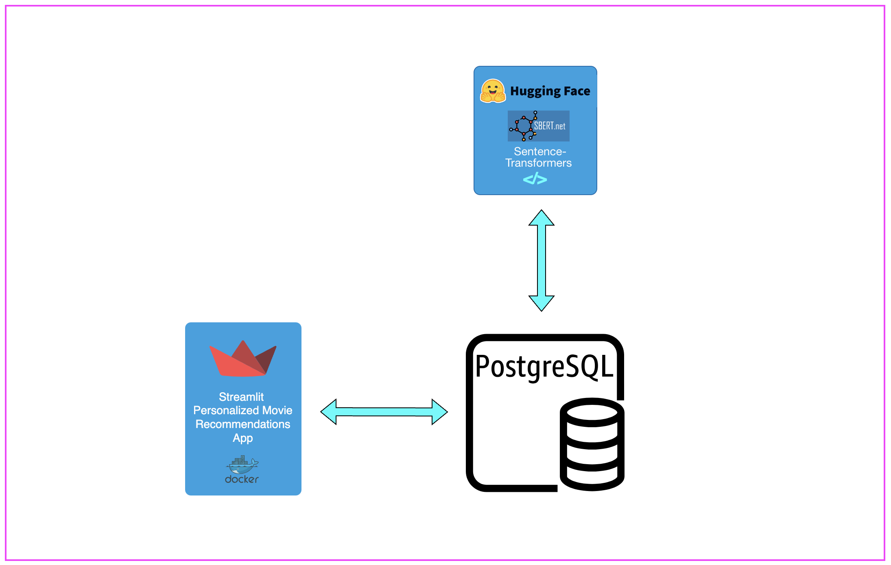
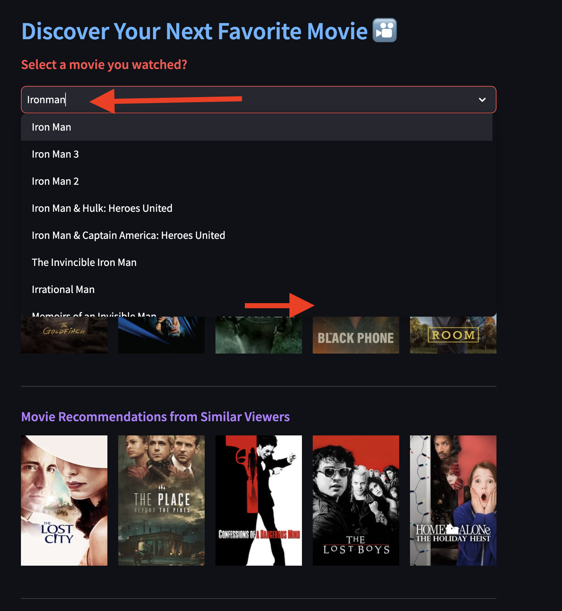
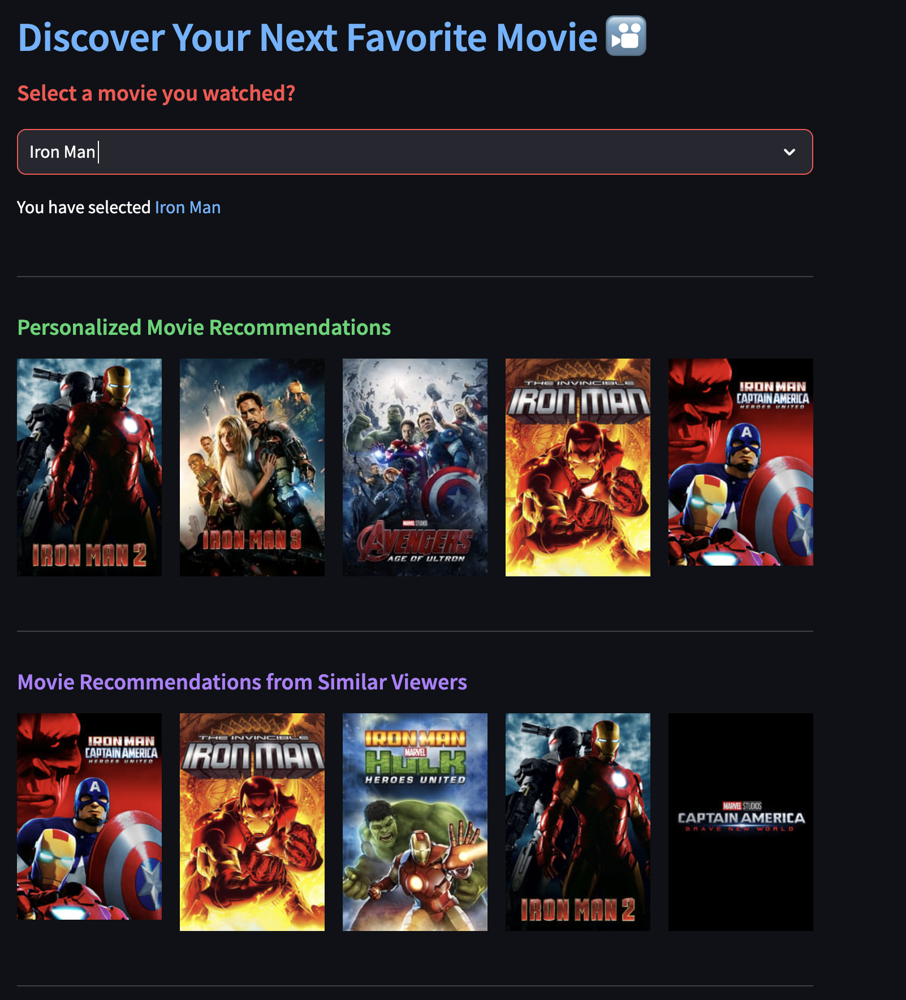

# PostgreSQL's pgvector Extension and AI-Powered Movie Recommendations

`pgvector` is an open-source extension designed for PostgreSQL, enriching the database system's capabilities with robust support for high-dimensional vector data and operations. Its purpose is to efficiently manage vector data, positioning PostgreSQL as a formidable choice for applications reliant on vector-based computations and rapid similarity searches.

In this post, we harness the power of the open-source `pgvector` extension for PostgreSQL. This extension simplifies the storage of embeddings and empowers us to perform efficient queries for finding a vector's nearest neighbors.

We'll illustrate this functionality through a practical use case: crafting personalized movie recommendations. Our approach involves generating embeddings for a movie catalog & user reviews using a pre-trained model, specifically the HuggingFace all-mpnet-base-v2 sentence transformer. These embeddings are then stored in `vector` type in PostgreSQL using the PgVector extension, allowing us to leverage them for creating personalized movie recommendations.

## Architecture



## Prerequisites

To successfully complete this solution walkthrough, ensure that your workstation has the following software installed:


 1. Docker ([Mac](https://docs.docker.com/desktop/install/mac-install/), [Windows](https://docs.docker.com/desktop/install/windows-install/) and [Linux](https://docs.docker.com/desktop/install/linux-install/))
 2. Git ([Mac](https://git-scm.com/download/mac), [Windows](https://git-scm.com/download/win) and [Linux](https://git-scm.com/download/linux))


## Solution

1. Run the following on your laptop to clone the Git repository, and start the Services: postgresql and Streamlit application containers.The dockerized PostgreSQL database container is preconfigured with pgvector extension, and a sample movie dataset.

```
	git clone https://www.github.com/thecloudloop/pgvector-movie-recommendations.git
	cd pgvector-movie-recommendations
	docker-compose up --detach --build --pull always
```

2. Next, run the following command to generate embeddings for movie overviews and user reviews: The 'movie-recommendations-app' container includes a preconfigured Python script for generating embeddings based on movie descriptions, keywords, and user reviews. Please keep in mind that this step may take approximately 20 minutes to finish.

```
	docker exec -ti pgvector-movie-recommendations-app-1 python3 /app/generate_embeddings.py
```

3. Next, open the URL http://localhost:8501 from a browser to open Streamlit application, enter a movie name that you watched and to generate personalized movie recommendations.



The output would look like below:



## Cleanup

1. Stop the services

```
	docker-compose down
	docker volume rm pgvector-movie-recommendations_postgres_data1
```
